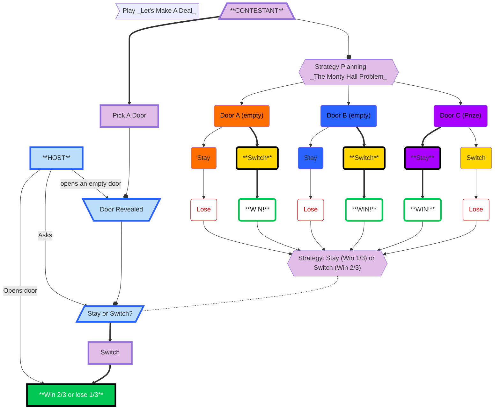

### _Let's Make A Deal_ explained
Two people decide to play a game called _Let's Make A Deal_.  
* One person is the Host.
* One person is the Contestant.
* There are three doors, one of which hides a prize. The Host knows where the prize is, the Contestant does not.
    * Doors were used in the original game, but it can be anything that hides the prize (e.g. a cup). 
#### HOST
1. After the Contestant chooses a door: the Host *opens an empty door* (**Door Revealed**).
    * Do not open the door the contestant chose.
    * Do not open the door that hides the prize.
4. The Host *Asks* the Contestant if they want to **Stay or Switch** their door as their final option.
5. The Hosts *Opens door* the Contestant chose.
#### CONTESTANT
* The contestant does not know what is behind the doors.
* This is a game of chance.
   * No skill in picking the first door.
   * Skill is only involved in the strategy for picking the second door.
   * Equivalent to the Host secretly lettering the doors and placing the prize behind Door C.
      ##### Strategy Planning 
     This is called the **Monty Hall Problem** after the host of the orginal show called _Let's Make a Deal_ back in the 1960s.
        1. Should you stay with your orginal door or switch to a new door?
           * If you randomly Pick **_Door A_**:
               * the Host reveals Door D: they know it is empty.
               * If you **Stay** with Door A as your final choice then you will **Lose**.
               * If you **Switch** you choose Door C as your final choice you **WIN!**
            * If you randomly Pick **_Door B_**:
               * the Host reveals Door A: they know it is empty.
               * If you **Stay** with Door B as your final choice then you will **Lose**.
               * If you **Switch** and choose Door C as your final choice you **WIN!**
            * If you randomly Pick **_Door C_**:
               * the Host reveals either Door A or Door B: they know both are empty.
               * If you **Stay** with Door C as your final choice then you **WIN!**
               * If you **Switch** and choose the other Door as your final choice you **Lose**.
        2. The strategy suggests that if you **Switch** doors for your final choice you will **WIN** 2/3 of the time.
            * You will lose 1/3 of the time you **Stay** with your orginal Door as your final choice.  
        3. Now you know what strategy you will use when asked if you should **Stay** or **Switch** Doors.
            * **SWITCH!**
1. **Pick A Door**. This is a random choice since there is no information about the prize location.
2. The Host will reveal an empty door (**Door Revealed**). The Host always chooses an empty door.
3. The Host *Asks* if you would like to **Stay or Switch** Doors?
4. You **Switch** because you are applying the **Monty Hall Problem** strategy from above.
5. The Host *Opens door* you choose as your final answer.
6. With the strategy you chose you will **Win 2/3 or lose 1/3** of the time. It is more likely that you won!
#### REFERENCE
Solution to the Monty Hall Problem. The Runcible Spoon Society. 2000. http://www.curiouser.co.uk/monty/montyhall2.htm
