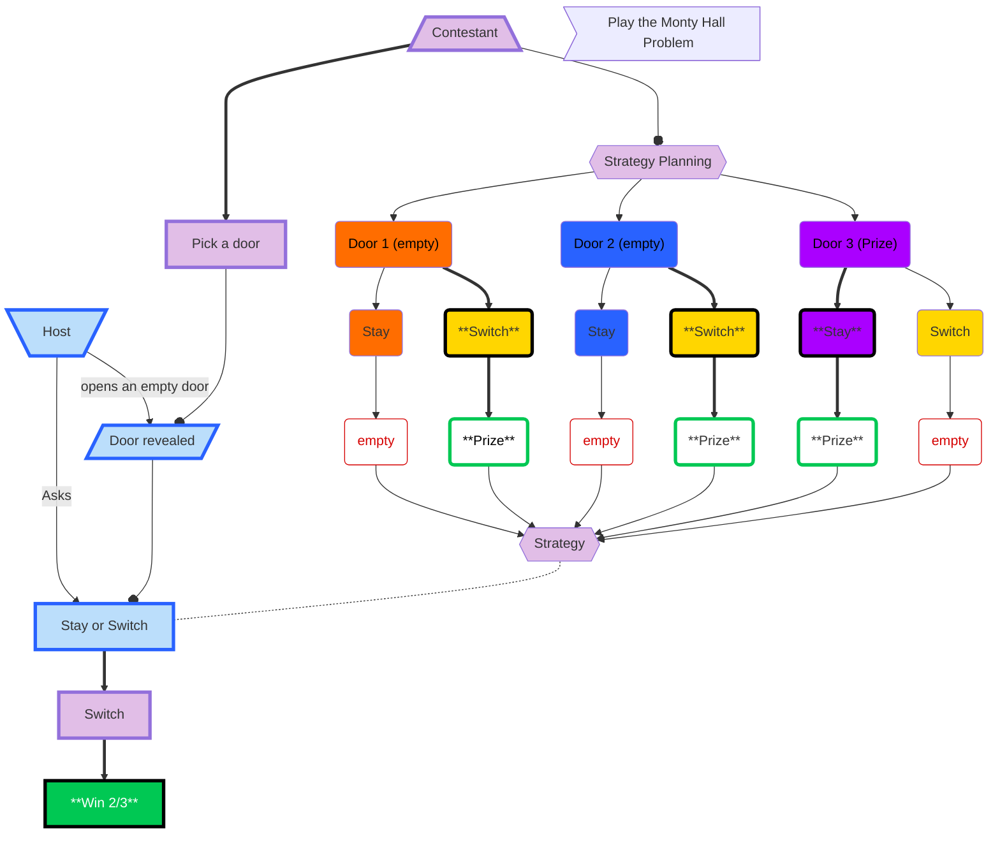

```mermaid
flowchart TD
    B["Contestant"] ==> D["Pick a door"]
    C["Host"] -- opens an empty door --> E["Door revealed"]
    D ---o E
    C --Asks--> AB
    E ---o AB["Stay or Switch"]
    AB ==> G["Switch"]
    B ---o H["Strategy Planning"]
    H --> I("Door 1 (empty)") & N("Door 2 (empty)") & S("Door 3 (Prize)")
    I --> J("Stay")
    I ==> K("**Switch**")
    J --> L("empty")
    K ==> M("**Prize**")
    N --> O("Stay")
    N ==> P("**Switch**")
    O --> Q("empty")
    P ==> R("**Prize**")
    S ==> T("**Stay**")
    S --> U("Switch")
    T ==> V("**Prize**")
    U --> W("empty")
    L & M & Q & R & V & W--> F["Strategy"]
    F -.- AB
    G ==> Z["**Win 2/3**"]
    A>"Play the Monty Hall Problem"]
    B@{ shape: trap-b}
    C@{ shape: trap-t}
    E@{ shape: lean-r}
    F@{ shape: hex}
    H@{ shape: hex}
    style B fill:#E1BEE7, stroke-width:4px,stroke-dasharray: 0
    style C fill:#BBDEFB,stroke:#2962FF,stroke-width:4px,stroke-dasharray: 0
    style D fill:#E1BEE7, stroke-width:4px,stroke-dasharray: 0
    style E fill:#BBDEFB,stroke:#2962FF,stroke-width:4px,stroke-dasharray: 0
    style F fill:#E1BEE7
    style G fill:#E1BEE7, stroke-width:4px,stroke-dasharray: 0
    style H fill:#E1BEE7
    style I color:#000000,fill:#FF6D00
    style N color:#000000,fill:#2962FF
    style S color:#000000,fill:#AA00FF
    style J fill:#FF6D00
    style M fill:transparent,stroke-width:4px,stroke-dasharray: 0,stroke:#00C853,color:#000000
    style K fill:#FFD600,stroke-width:4px,stroke-dasharray: 0,stroke:#000000
    style L fill:transparent,stroke:#D50000,color:#D50000
    style M fill:transparent,stroke-width:4px,stroke-dasharray: 0,stroke:#00C853,color:#000000
    style O fill:#2962FF
    style P fill:#FFD600,stroke-width:4px,stroke-dasharray: 0,stroke:#000000
    style Q fill:transparent,stroke:#D50000,color:#D50000
    style R fill:transparent,stroke-width:4px,stroke-dasharray: 0,stroke:#00C853
    style T fill:#AA00FF,stroke-width:4px,stroke-dasharray: 0,stroke:#000000
    style U fill:#FFD600
    style V fill:transparent,stroke-width:4px,stroke-dasharray: 0,stroke:#00C853
    style W fill:transparent,stroke:#D50000,color:#D50000
    style Z fill:#00C853,color:#FFFFFF,stroke-width:4px,stroke-dasharray: 0,stroke:#000000
    style AB fill:#BBDEFB,stroke:#2962FF,stroke-width:4px,stroke-dasharray: 0
```
