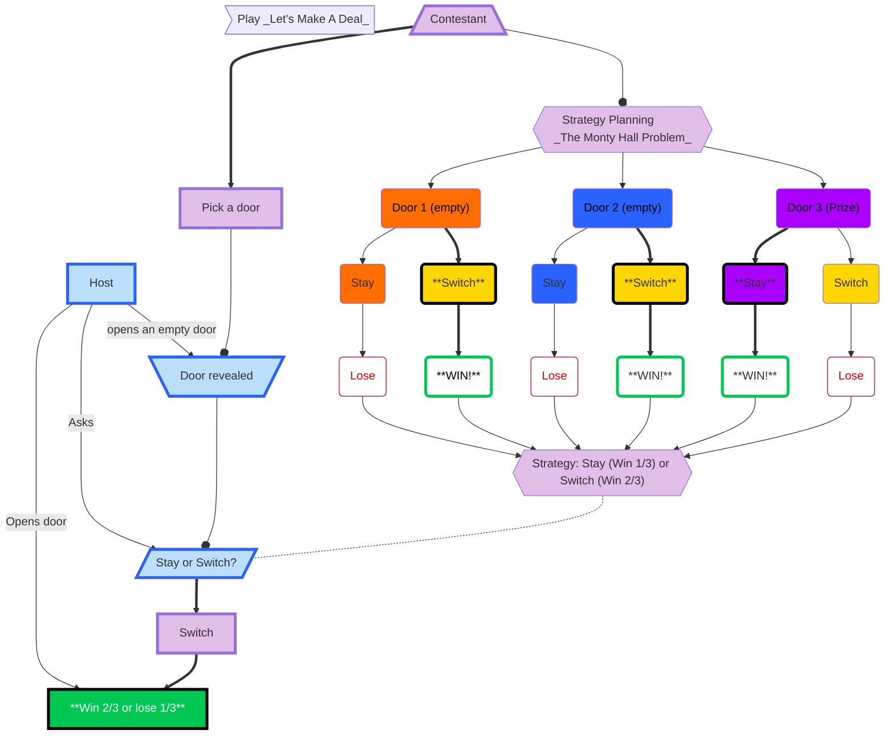

### _Let's Make A Deal_ explained
Two people decide to play a game called _Let's Make A Deal_.  
* One person becomes the Host.
* One person becomes the Contestant.
* There are three doors, one of which hides a prize. The Host knows where the prize is, the Contestant does not.
    * Doors were used in the original game, but it can be anything that hides the prize (e.g. a cup). 
### Host
1. After the Contestant chooses a door: the Host opens (**Reveals**) a door.
    * Do not open the door the contestant chose.
    * Open an empty door.
4. Ask the Contestant if they want to **Stay or Switch** their door as their final option.
5. Open the door the Contestant choose.
### Contestant
1. Pick a door: 1, 2, or 3.
    * The contestant does not know what is behind the doors.
    * This is a game of chance.
        * No skill in picking the first door.
        * Skill is only involved in the strategy for picking the second door.
       #### Strategy for picking 2nd door
       This is called the **Monty Hall Problem** after the host of the orginal show called _Let's Make a Deal_ back in the 1960s.
       1. Should you stay with your orginal door or switch to a new door?
            * If you Pick **_Door 1_**:
                * the Host reveals Door 2: they know it is empty.
               * If you **stay** with Door 1 as your final choice then you will lose.
               * If you **stitch** and choose Door 3 as your final choice you **WIN!**
            * If you Pick **_Door 2_**:
               * the Host reveals Door 1: they know it is empty.
               * If you **stay** with Door 2 as your final choice then you will lose.
               * If you **stitch** and choose Door 3 as your final choice you **WIN!**
            * If you Pick **_Door 3_**:
               * the Host reveals either Door 1 or Door 2: they know both are empty.
               * If you **stay** with Door 3 as your final choice then you **WIN!**
               * If you **stitch** and choose the other Door as your final choice you lose.
        2. The strategy suggests that if you **Switch** doors for your final choice you will **WIN** 2/3 of the time.
           * You will lose 1/3 of the time you **Stay** with your orginal Door as your final choice.
        3. Now you know what strategy you will use when asked if you should **Stay** or **Switch** Doors.
           * **SWITCH!**
2. The Host will reveal an empty door.
3. The Host will ask if you would like to **Stay or Switch** Doors?
4. You **Switch** because you are applying the **Monty Hall Problem** strategy.
5. The Host opens the door you choose as your final answer.
6. I don't know if you won or lost, but it is more likely that you won!
