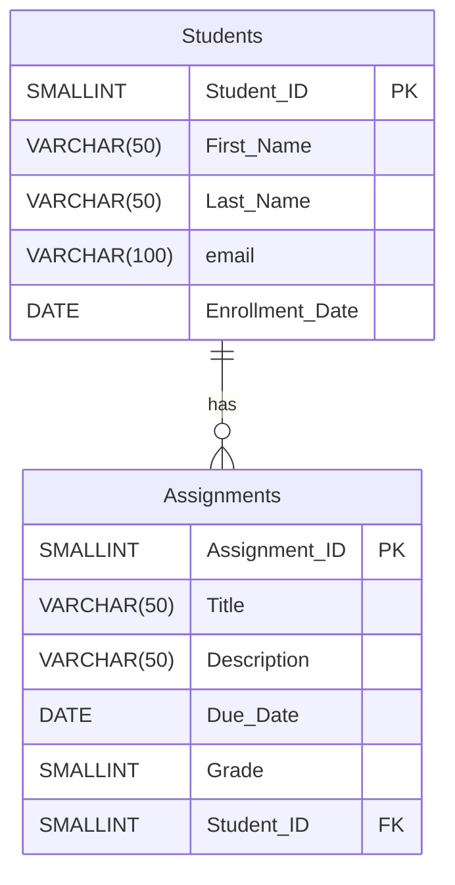

```mermaid
erDiagram
  Students {
    SMALLINT Student_ID PK
    VARCHAR(50) First_Name
    VARCHAR(50) Last_Name
    VARCHAR(100) email
    DATE Enrollment_Date
}
  Assignments {
    SMALLINT Assignment_ID PK
    VARCHAR(50) Title
    VARCHAR(50) Description
    DATE Due_Date
    SMALLINT Grade
    SMALLINT Student_ID FK
}
Students ||--o{ Assignments : "has"

```
