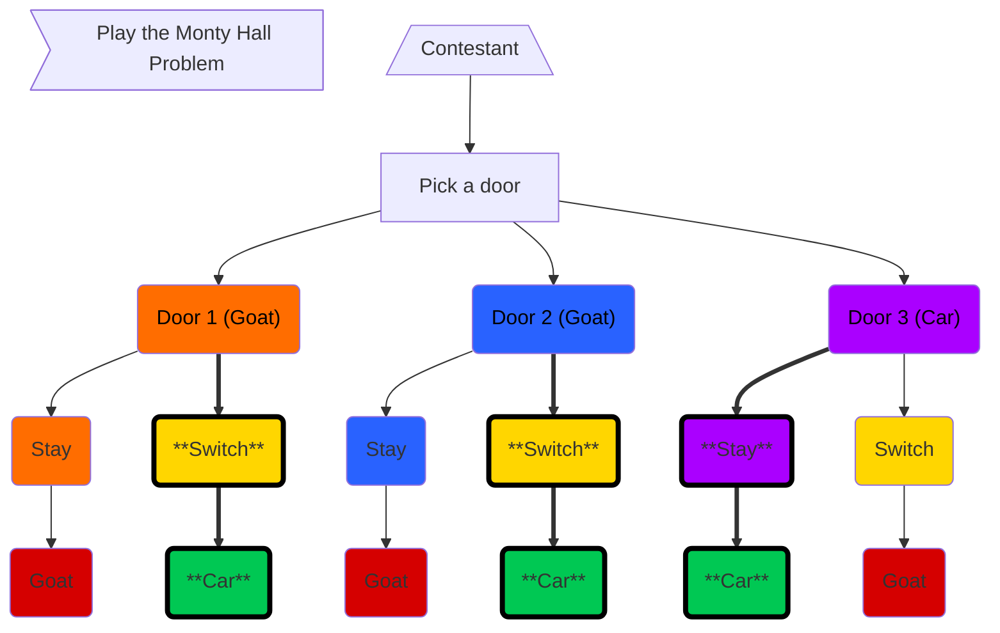

```mermaid
flowchart TD
    A>"Play the Monty Hall Problem"]
    B("Contestant") --> C["Pick a door"]
    C --> D("Door 1 (Goat)") & I("Door 2 (Goat)") & N("Door 3 (Car)")
    D --> E("Stay")
    D ==> F("**Switch**")
    E --> G("Goat")
    F ==> H("**Car**")
    I --> J("Stay")
    I ==> L("**Switch**")
    J --> K("Goat")
    L ==> M("**Car**")
    N ==> O("**Stay**")
    N --> P("Switch")
    O ==> Q("**Car**")
    P --> R("Goat")
    B@{ shape: trap-b}
style D color:#000000,fill:#FF6D00
    style I color:#000000,fill:#2962FF
    style N color:#000000,fill:#AA00FF
    style E fill:#FF6D00
    style F fill:#FFD600,stroke-width:4px,stroke-dasharray: 0,stroke:#000000
    style G fill:#D50000
    style H fill:#00C853,stroke-width:4px,stroke-dasharray: 0,stroke:#000000
    style J fill:#2962FF
    style L fill:#FFD600,stroke-width:4px,stroke-dasharray: 0,stroke:#000000
    style K fill:#D50000
    style M fill:#00C853,stroke-width:4px,stroke-dasharray: 0,stroke:#000000
    style O fill:#AA00FF,stroke-width:4px,stroke-dasharray: 0,stroke:#000000
    style P fill:#FFD600
    style Q fill:#00C853,stroke-width:4px,stroke-dasharray: 0,stroke:#000000
    style R fill:#D50000
```
