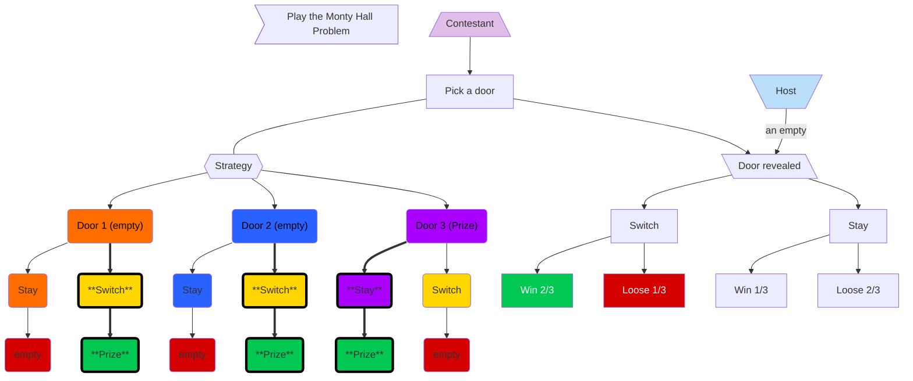

```mermaid
flowchart TD
    A>"Play the Monty Hall Problem"]    
    B["Contestant"] --> C["Pick a door"]
    C --- D["Strategy"]
    C --> T["Door revealed"]
    D --> E("Door 1 (empty)") & J("Door 2 (empty)") & O("Door 3 (Prize)")
    E --> F("Stay")
    E ==> G("**Switch**")
    F --> H("empty")
    G ==> I("**Prize**")
    J --> K("Stay")
    J ==> M("**Switch**")
    K --> L("empty")
    M ==> N("**Prize**")
    O ==> P("**Stay**")
    O --> Q("Switch")
    P ==> R("**Prize**")
    Q --> S("empty")
    U["Host"] -- an empty --> T
    T --> Y["Switch"] & V["Stay"]
    Y --> W["Win 2/3"] & X["Loose 1/3"]
    V --> Z["Win 1/3"] & AA["Loose 2/3"]
    B@{ shape: trap-b}
    D@{ shape: hex}
    T@{ shape: lean-l}
    U@{ shape: trap-t}
    style B fill:#E1BEE7
    style E color:#000000,fill:#FF6D00
    style J color:#000000,fill:#2962FF
    style O color:#000000,fill:#AA00FF
    style F fill:#FF6D00
    style G fill:#FFD600,stroke-width:4px,stroke-dasharray: 0,stroke:#000000
    style H fill:#D50000
    style I fill:#00C853,stroke-width:4px,stroke-dasharray: 0,stroke:#000000
    style K fill:#2962FF
    style M fill:#FFD600,stroke-width:4px,stroke-dasharray: 0,stroke:#000000
    style L fill:#D50000
    style N fill:#00C853,stroke-width:4px,stroke-dasharray: 0,stroke:#000000
    style P fill:#AA00FF,stroke-width:4px,stroke-dasharray: 0,stroke:#000000
    style Q fill:#FFD600
    style R fill:#00C853,stroke-width:4px,stroke-dasharray: 0,stroke:#000000
    style S fill:#D50000
    style U fill:#BBDEFB
    style W fill:#00C853,color:#FFFFFF
    style X fill:#D50000,color:#FFFFFF
```
