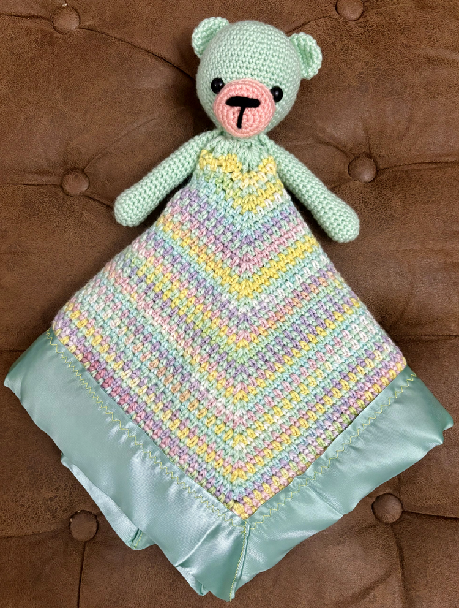
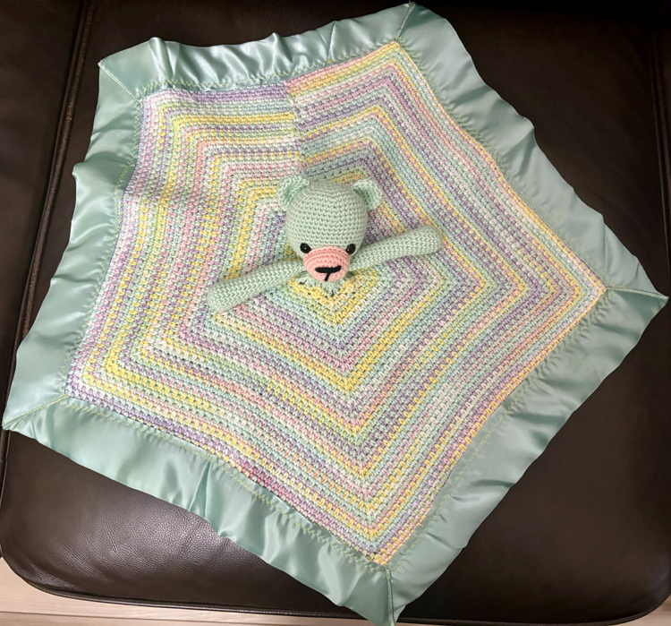

# BADmommydale.github.io

**Barbara Ann Dale**  
badale@my.waketech.edu

This github is an account made for my CTI class.  
This repository is for my assignments in my CTI 110 class.

# About Me
I am currently a stay-at-home mom.  I have a degree in History from Texas A&M University and an MBA from the University of Phoenix.  

## My Interests
* Cooking
*  Reading
* Crochet   
     
  I knew I had become an expert at crochet when I designed my own creation.  This is a LovieBear that is a small pentagon blanket that can be used as a stuffed animal when folded.  
    
## Websites I Recommend
  - [DaleLicious](https://cultivatinghealthyhabits.blogspot.com/) - I have made a site for all my recipes.
    - There are no ADs to get in the way.
    - I have color coded the recipe for ease of viewing when scrolling from ingredients to directions and back again.
    - I have also included a spreadsheet of how I meal plan and grocery shop to stick within a budget.
      
  - [74 Gear](https://www.youtube.com/@74gear) - My son and I listen to Kelsey on our drive to WakeTech everyday. He is a 747 pilot and explains a lot about what goes on in the field of aviation.

  - [Crochet Turtorial](https://thewoobles.com/pages/crochet-tutorials) - If you are intersted in learning how to crochet this is the best site to get you started.
